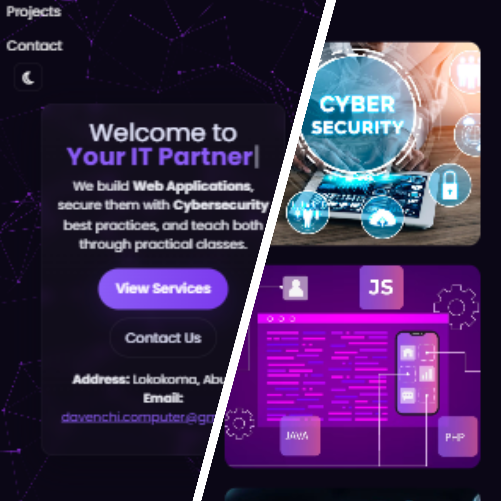
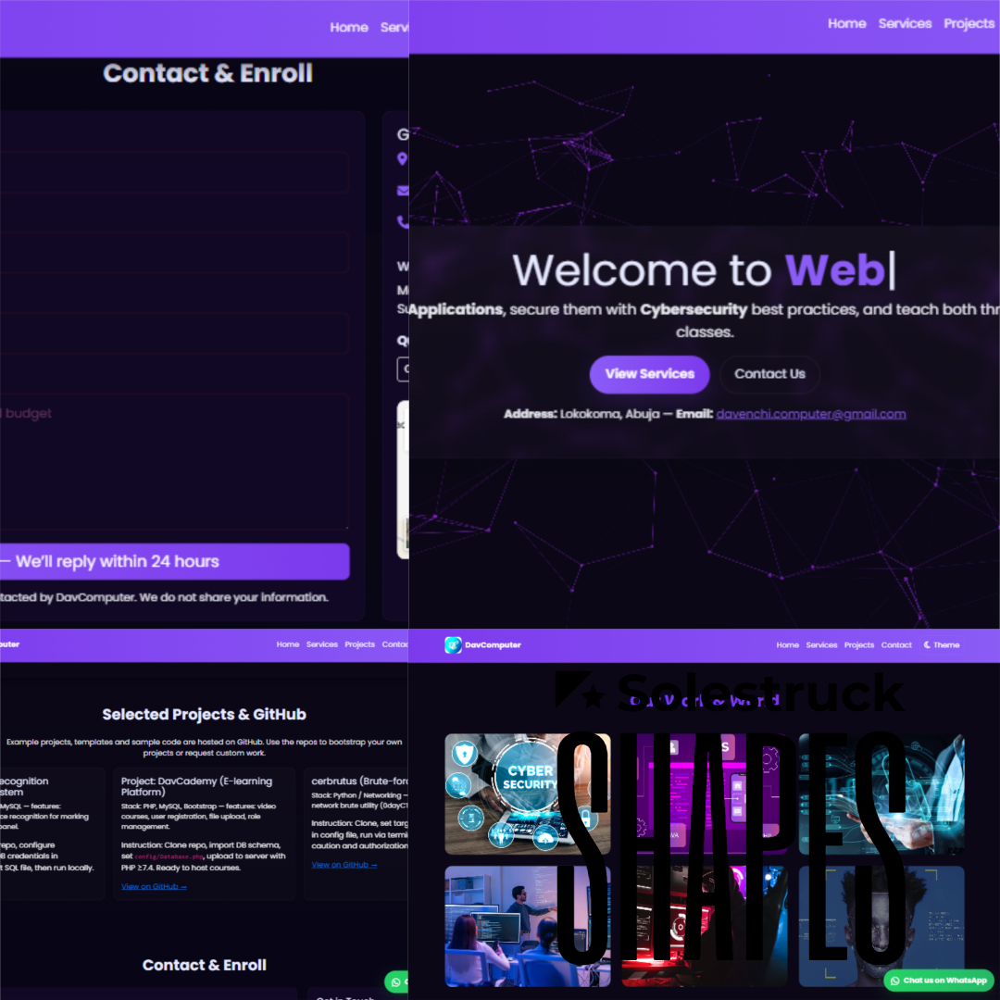

# Davcademy – Personal Portfolio / Academy Projects


[](https://twitter.com/intent/follow?screen_name=alhemdrew_)
[](https://youtu.be/YOUR_VIDEO_ID)

**Davcademy** is a responsive educational and portfolio website showcasing my projects, tutorials, and tech-related content. Built with HTML, CSS, and JavaScript, it’s designed for accessibility and smooth user experience across all devices.

## Demo




## Prerequisites

Before you begin, ensure you have the following installed:

* [Git](https://git-scm.com/downloads) – for cloning the repository.

## Installing Davcademy

Linux and macOS:

```bash
sudo git clone https://github.com/alhemdrew/davcademy.git
